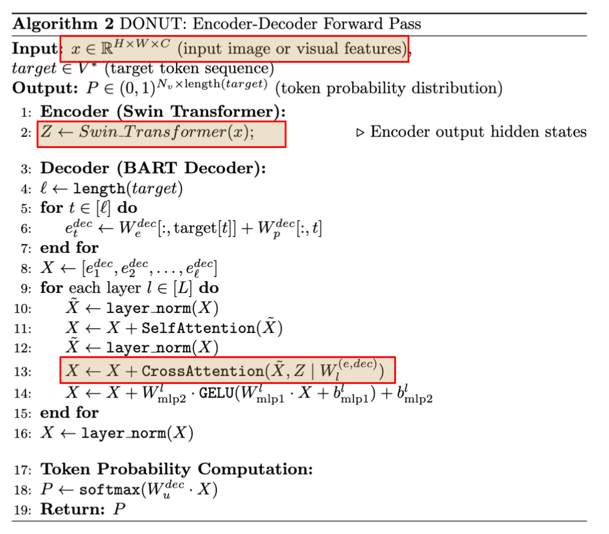

<div align="center">
    
# Donut 🍩 : Document Understanding Transformer

Donut and SynthDoG | [Paper](https://arxiv.org/abs/2111.15664) | [Poster](https://docs.google.com/presentation/d/1m1f8BbAm5vxPcqynn_MbFfmQAlHQIR5G72-hQUFS2sk/edit?usp=sharing) | [Code](https://github.com/clovaai/donut)

</div>

### Overview

**Understanding document images** (e.g., invoices) is a core but challenging task since it requires complex functions such as reading text and a holistic understanding of the document. 

**OCR-based**: Current Visual Document Understanding (VDU) methods outsource the task of reading text to <span style="color:purple">off-the-shelf OCR</span>, Optical Character Recognition engines and focus on the <span style="color:purple">understanding OCR outputs</span>. 
Although such OCR-based approaches have shown promising performance, they suffer from 
- 🙁 high computational costs for using OCR; 
- 🙁 inflexibility of OCR models on languages or types of documents; 
- 🙁 OCR error propagation to the sub-sequent process.

**<span style="color:blue">Donut: OCR-free VDU model </span>**: **Do**cume**n**t **un**derstanding **t**ransformer, a Transformer-based end-to-end model for Visual Document Understanding. 
- 😍 End-to-end model, OCR-free
- 😍 Donut is conceptually simple yet effective. 
- 😍 Using Vision Transformer + Multi-modal Decoder
- 😍 Achieves state-of-the-art performances on various VDU tasks in terms of both speed and accuracy.
<span style="color:gray">*Note:* Donut skips the traditional OCR step, which avoids potential errors in text recognition and allows for direct processing of complex, unstructured documents, such as receipts or invoices.</span>


<!-- Five-minute overview providing context, stating the problem the paper is addressing, characterizing the approach, and giving a brief account of how the problem was addressed. -->

### Architecture Overview

- Donut’s architecture is built on Transformer-based sequence modeling principles. Unlike traditional models, which first convert images into text via OCR, Donut **treats the entire document image as input** to a Vision Transformer (ViT) and processes it directly.
**Formal Pseudocode:** *OCR-based and Donut*


 
**<span style="color:purple">The pipeline of Donut.</span>** The encoder maps a given document image into embeddings. With the encoded embeddings, the decoder generates a sequence of tokens that can be converted into a target type of information in a structured form.

#### <span style="color:blue">Encoder: Swin Transformer</span>
- What for: maps a given document image into embeddings, i.e., $x \in \mathbb{R}^{H\times W \times C}$ $\rightarrow$ $\{z_i \in \mathbb{R}^d, 1 \leq i \leq n\}$
- How:
    - The input image $x \in \mathbb{R}^{H \times W \times C}$ is split into non-overlapping patches.
    - These patches are fed through multiple Swin Transformer [liu2021swin] blocks, each consisting of:
        - A shifted window-based multi-head self-attention module.
        - Two-layer MLP: Captures non-linear relationships.
        - Patch merging layers: Reduces patch tokens at each stage.
    - Output: Final visual embeddings $\{z_i \in \mathbb{R}^d, 1 \leq i \leq n\}$, where $n$ is feature map size or the number of image patches and $d$ is the dimension of the latent vectors of the encoder. 

    <!-- - Use Swin Transformer [liu2021swin] because of the best performance. 
    - How does Swin Transformer work: splits the input image $x$ into non-overlapping patches. Swin Transformer blocks, consist of a shifted window-based multi-head self-attention module and a two-layer MLP, are applied to the patches. Then, patch merging layers are applied to the patch tokens at each stage. The output of the final Swin Transformer block ${z}$ is fed into the following textual decoder. -->


#### <span style="color:blue">Decoder: BART</span> 
- What for: Given the ${z}$, the textual decoder generates a token sequence $(y_i)^m_{i=1}$, where $y_i \in \mathbb{R}^v$ is an one-hot vector for the $i-th$ token, $v$ is the size of token vocabulary, and $m$ is a hyperparameter, respectively. 
- How: 
    - Use BART [lewis-etal-2020-bart], a variant of the Transformer architecture. BART is pretrained on a diverse corpus, and publicly available multilingual BART weights are used for the decoder in Donut.
    - **Self-attention** to capture dependencies within the generated sequence.
    - **Cross-attention** to align the generated tokens with relevant parts of the encoder’s visual embeddings.

    - The cross-attention mechanism is computed as:
  \[
  \operatorname{Attention}(Q, K, V) = \operatorname{softmax}\left(\frac{Q K^{\top}}{\sqrt{d_k}}\right) V
  \]
  Where:
  \(Q\) is the query from the decoder’s hidden state.
  \(K\) and \(V\) are the visual embeddings from the encoder.


#### <span style="color:blue">Donut: Encoder-Decoder Forward Pass</span>


- Encoder: The Swin Transformer encoder processes images using patches and windowed self-attention.
- Decoder: The BART decoder follows a self-attention + cross-attention mechanism for text generation, allowing it to align with the encoder outputs.
<!-- - Cross-attention aligns the current token being generated with the most relevant visual embeddings from the encoder's output.<div align="center">
  $\operatorname{Attention}(Q, K, V)=\operatorname{softmax}\left(\frac{Q K^{\top}}{\sqrt{d_k}}\right) V$
  </div align="center">

  - Query $Q$: Decoder hidden state.
  - Key $K$: Visual embeddings from the encoder.
  - Value $V$: Same visual embeddings from the encoder (used for aggregation). -->
- Comparison with learnt EDTransformer:
    - Takes two inputs: (i) the visual embedding $Z$ and (ii) the target generated tokens.
    - Cross-attention: Every decoder layer performs **cross-attention** with the encoder’s output. 

<span style="color:gray">*Note:* Cross-attention ensures that for each token being generated, the decoder aligns with the relevant visual patch embeddings. For example, while generating the token "invoice_date", the decoder focuses on the patch embeddings that correspond to the visual region containing the date in the document.</span>

## Critical Analysis
**Strengths:**

- OCR-free design: Eliminates common bottlenecks in VDU pipelines.
- Simplicity: A unified end-to-end model for various tasks.
- Multi-lingual and domain-adaptive: Performs well across diverse datasets and languages.

**Limitations:**

- *Training Data Bias:* Pre-training on synthetic data alone may not generalize well to real-world scenarios without further domain-specific fine-tuning (4 languages)
- *High Pre-training Cost:* Training Donut with 11M images and large-scale synthetic data requires significant computational resources (e.g., 64 A100 GPUs), making it less accessible for smaller research teams or organizations with limited resources.
- *Challenging for deployments:* Although Donut achieves faster inference than OCR-based systems, it still relies on heavy transformer architectures that might not be suitable for low-power or mobile devices.
- *OOD performance concern:* Donut may struggle with tiny or low-contrast text in documents where OCR-based systems with image pre-processing steps could perform better. For example, under OOD layouts, font-sizes, languages, etc.

## Impacts
1. Elimination of OCR Bottleneck: Traditional document processing pipelines heavily rely on OCR to convert images into text, which introduces errors (e.g., handling poor-quality scans, non-standard fonts, handwritten text). By skipping the OCR step, Donut makes document understanding more accurate and robust to noise, complex layouts, and multilingual texts. This makes it especially impactful in industries with diverse document formats (e.g., logistics, banking, healthcare).
2. Improved Multimodal Learning: Through Swin Transformer + BART decoder cross-attention, Donut learns to interpret both visual and textual content simultaneously. This aligns text with spatial document elements (e.g., date fields, amounts) and makes it more effective for structured data extraction in receipts, invoices, contracts, and forms.
3. Generalization and Flexibility Across Tasks: With its publicly available multilingual BART weights, Donut can generalize across multiple languages and document types, making it an accessible and scalable solution.
4. Enabling Automation and Reducing Costs: Donut enables the automation of structured data extraction from unstructured images, reducing the need for manual effort and cutting operational costs. Its OCR-free approach also speeds up the process.
5. The vision-based approach allows Donut to expand the scope of Document AI, making it more applicable to handwritten documents, forms with non-standard elements, or creative layouts. It also makes the solution more language-agnostic by not relying on OCR’s language-specific models.

To this end, this work demonstrates that cross-modal attention between visual and textual features is effective for real-world tasks, encouraging further exploration of image-to-text models and end-to-end multimodal learning approaches.


## Questions for Discussion
1. What do you think will be the factors affecting the performance of training Donut?
2. Why was the Swin Transformer selected as the visual encoder, and could alternative backbones (e.g., ViT) provide better results?
3. In which cases where Donut fails to extract accurate information (e.g., as shown in the DocVQA examples), what are the key reasons? Would additional fine-tuning with specialized datasets solve these issues?

## Demonstrating of using Donut
- Implementation of fine-tuning Donut [here](Fine_tune_Donut_on_DocVQA.ipynb)
- Implementation of using Donut [here](demo.ipynb)

**<span style="color:purple">Well-formated Data</span>**


**<span style="color:purple">OOD Data</span>**


```{
  "menu": [
    {
      "nm": "ORDER #0001 FOR JUDYJUDYJUDY",
      "price": "LAST MONTH"
    },
    {
      "nm": "SATURDAY, OCTOBER 19, 2024",
      "price": "AMT"
    },
    {
      "nm": "VICIOUS - SABRINA",
      "num": "01",
      "price": "2:30"
    },
    {
      "nm": "CARPENTER",
      "num": "02",
      "price": "02"
    },
    {
      "nm": "BREAK MY HEART AGAIN -",
      "num": "02",
      "price": "3:58"
    },
    {
      "nm": "FINNEAS",
      "num": "03",
      "price": "2:17"
    },
    {
      "nm": "SABRINA CARPENTER",
      "num": "05",
      "price": "4:21"
    },
    {
      "nm": "WILDFLOWER - BILLIE",
      "num": [
        {
          "price": "06"
        },
        {
          "nm": "LITTLE WINDOW - FINNEAS"
        }
      ],
      "price": "4:14"
    },
  ],
  "sub_total": {
    "subtotal_price": "34:39"
  },
  "total": {
    "total_price": "34:29",
    "creditcardprice": "123421",
    "menuqty_cnt": "2023"
  }
}
```

## Resource links
- [Link to Paper](https://arxiv.org/abs/2111.15664)
- [PapersWithCode link](https://paperswithcode.com/paper/donut-document-understanding-transformer)
- [Live Demo](https://huggingface.co/spaces/nielsr/donut-docvqa)
- [Fine-tuning Donut model tutorial](https://github.com/NielsRogge/Transformers-Tutorials/blob/master/Donut/DocVQA/Fine_tune_Donut_on_DocVQA.ipynb)
- [Huggingface Tutorial](https://huggingface.co/naver-clova-ix/donut-base-finetuned-docvqa)
- [Blog of A Comprehensive Analysis](https://ubiai.tools/fine-tuning-donut-model-on-docvqa-a-comprehensive-analysis/)

## Citation
```
@inproceedings{liu2021swin,
  title={Swin transformer: Hierarchical vision transformer using shifted windows},
  author={Liu, Ze and Lin, Yutong and Cao, Yue and Hu, Han and Wei, Yixuan and Zhang, Zheng and Lin, Stephen and Guo, Baining},
  booktitle={Proceedings of the IEEE/CVF international conference on computer vision},
  pages={10012--10022},
  year={2021}
}

@inproceedings{lewis-etal-2020-bart,
    title = "{BART}: Denoising Sequence-to-Sequence Pre-training for Natural Language Generation, Translation, and Comprehension",
    author = "Lewis, Mike  and
      Liu, Yinhan  and
      Goyal, Naman  and
      Ghazvininejad, Marjan  and
      Mohamed, Abdelrahman  and
      Levy, Omer  and
      Stoyanov, Veselin  and
      Zettlemoyer, Luke",
    editor = "Jurafsky, Dan  and
      Chai, Joyce  and
      Schluter, Natalie  and
      Tetreault, Joel",
    booktitle = "Proceedings of the 58th Annual Meeting of the Association for Computational Linguistics",
    month = jul,
    year = "2020",
    address = "Online",
    publisher = "Association for Computational Linguistics",
    url = "https://aclanthology.org/2020.acl-main.703",
    doi = "10.18653/v1/2020.acl-main.703",
    pages = "7871--7880"
}

@inproceedings{kim2022donut,
  title     = {OCR-Free Document Understanding Transformer},
  author    = {Kim, Geewook and Hong, Teakgyu and Yim, Moonbin and Nam, JeongYeon and Park, Jinyoung and Yim, Jinyeong and Hwang, Wonseok and Yun, Sangdoo and Han, Dongyoon and Park, Seunghyun},
  booktitle = {European Conference on Computer Vision (ECCV)},
  year      = {2022}
}
```
